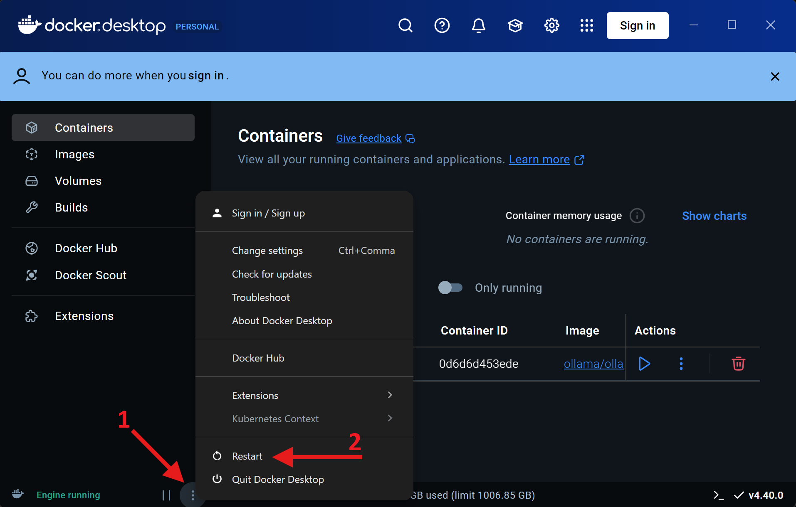
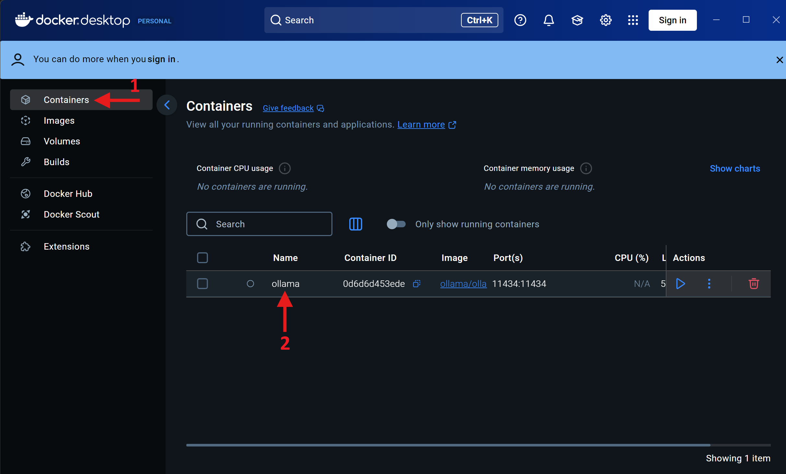
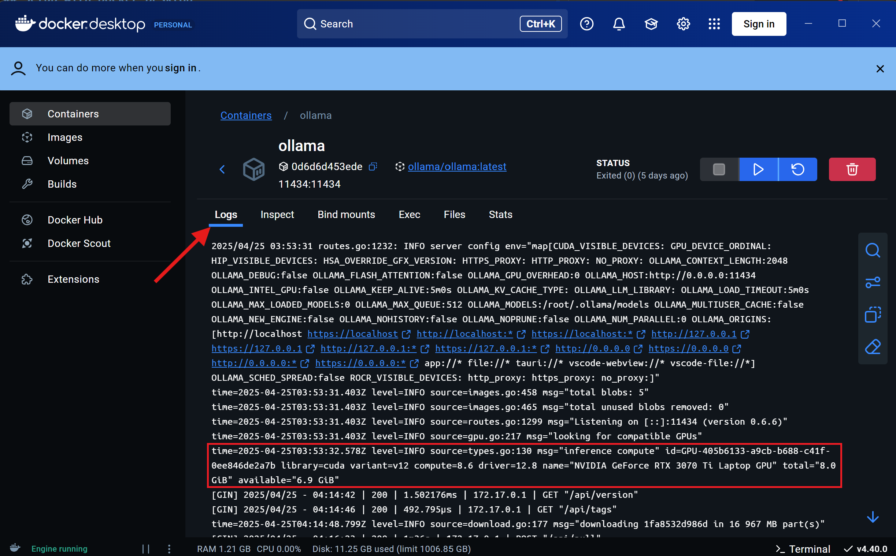
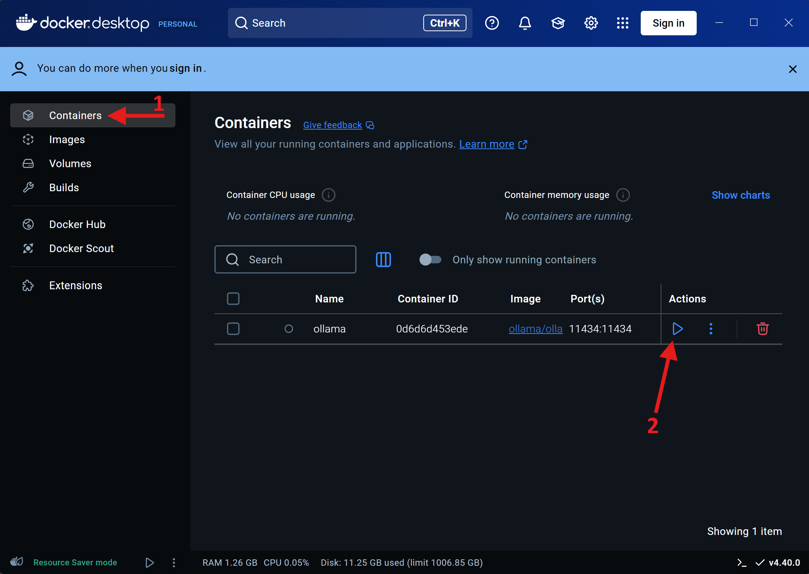

# Docker Setup Instructions

This document provides instructions on how to set up and run the project using Docker.

## Prerequisites

- Docker Desktop: [Install Docker Desktop](https://docs.docker.com/get-docker/)
- WSL2 (for Windows users): [Official Microsoft Documentation](https://learn.microsoft.com/en-us/windows/wsl/install)
- GPU Support (Optional, but recommended for LLM output speed):
  - NVIDIA GPUs: [NVIDIA Container Toolkit Installation](https://docs.nvidia.com/datacenter/cloud-native/container-toolkit/latest/install-guide.html)
  - AMD GPUs: See instructions below

## Setup with Docker Desktop

1. **Install Docker Desktop**:
   - Download and install Docker Desktop
   - On Windows, ensure Docker is configured to use WSL2

2. **Configure WSL Integration**:
   
   - In Docker Desktop, follow the arrows numbered 1, 2, and 3 on the screenshot to navigate through `Settings` > `Resources` > `WSL Integration`.
   - Either enable integration with your default WSL distro (arrow 4.1) OR select a specific one (arrow 4.2)
   - Click "Apply & Restart" if you make changes (arrow 5)

3. **Setup GPU Support (Optional, but recommended)**:
   - Open a terminal
     - On Windows, launch the WSL distro that Docker is integrated with. In the previous image, that would be `Ubuntu-24.04`, so run `wsl -d Ubuntu-24.04`, and run the following commands within that distro.
   - For NVIDIA GPU support, run:
     ```bash
     # Add NVIDIA repository keys
     curl -fsS https://nvidia.github.io/libnvidia-container/gpgkey | sudo gpg --dearmor -o /usr/share/keyrings/nvidia-container-toolkit-keyring.gpg
     
     # Add NVIDIA repository
     curl -s -L https://nvidia.github.io/libnvidia-container/stable/deb/nvidia-container-toolkit.list | sed 's#deb https://#deb [signed-by=/usr/share/keyrings/nvidia-container-toolkit-keyring.gpg] https://#g' | sudo tee /etc/apt/sources.list.d/nvidia-container-toolkit.list
     
     # Update package lists
     sudo apt-get update
     
     # Install NVIDIA container toolkit
     sudo apt-get install -y nvidia-container-toolkit
     
     # Configure Docker runtime
     sudo nvidia-ctk runtime configure --runtime=docker
     ```
   - (For AMD GPU support, nothing to do at this stage)
   - Close your terminal
   - Restart Docker
     - For Docker Desktop, click on the three vertical dots icon (arrow 1), then `Restart` (arrow 2)
   
     - On Linux (Ubuntu, Debian, CentOs, Fedora), running: `systemctl restart docker` should do it. You can prepend with `sudo` if necessary.

4. **Pull Ollama Image**:
   - Open a terminal capable of running docker commands.
     - In Docker Desktop you can open it by pressing the `Terminal` button:
     
     - Or any terminal of your system that can access to Docker
   - Write `docker pull ollama/ollama` in the terminal and press enter to run it.
     - It will download about 1.6GB
     - Once finished, click on the `Images` tab (arrow 1) of Docker Desktop, and check that `ollama/ollama` is available (arrow 2)
       
       - If it does not show up, try closing Docker Desktop (arrow 1, then arrow 2) and launch it again.
       
     - Alternatively, to check that the image exists, you can run the command `docker images -a`. The output should include a line similar to `ollama/ollama   latest    d42df3fe2285   11 days ago   4.85GB`

## Running Ollama with Docker

1. Choose the appropriate command whether you enabled GPU support, and depending on the GPU you have:

    * **CPU only**:
      ```bash
      docker run -d -v ollama:/root/.ollama -p 11434:11434 --name   ollama ollama/ollama
      ```
  
    * **NVIDIA GPU support**:
      ```bash
      docker run -d --gpus=all -v ollama:/root/.ollama -p 11434:11434 --name ollama ollama/ollama
      ```
    
    * **AMD GPU support**:
      ```bash
      docker run -d --device /dev/kfd --device /dev/dri -v ollama:/  root/.ollama -p 11434:11434 --name ollama ollama/ollama:rocm
      ```

2. Verify that GPU support is working correctly:
  - Go to the `Containers` tab in Docker Desktop (arrow 1) and select your Ollama container
  
    - Check the logs and search for a message indicating GPU detection, similar to:
      ```
      msg="inference compute" id=GPU-a826c853-a49e-a55d-da4d-804bfe10cdcf  library=cuda variant=v12 compute=8.6 driver=12.7 name="NVIDIA GeForce RTX 3070 Laptop GPU" total="8.0 GiB" available="7.0 GiB"
      ```
      
  - Alternatively, run the command `docker logs ollama` and search for the message in the output.

For more detailed instructions and options, refer to the [official Ollama Docker documentation](https://github.com/ollama/ollama/blob/main/docs/docker.md).

## Running Hatchling

1. **Clone the Repository**:
```bash
git clone <repository-url>
cd <repository-directory>
```

2. **Configure Environment**:
   - Navigate to the `docker` directory within the project
   - Modify the `.env` file if needed:
     - You may need to adjust `OLLAMA_HOST_API` to match where your Ollama container is hosted
     - You can change `DEFAULT_MODEL` to a specific LLM model (see [Ollama Models Library](https://ollama.com/search))
     - Choose a model appropriate for your hardware resources

3. **Start Ollama**:
   - On Docker Desktop, simply navigate to your containers (arrow 1), and press the play button (arrow 2)
   
   - Alternatively, run the command `docker start ollama`

4. **Start Hatchling**:
```bash
# From the docker directory in your project
docker-compose run --rm hatchling
```

The `--rm` flag ensures the container is removed when you exit the application.

**Notes**:
- The first time you run this command, it will build the image (typically takes 15-30 seconds)
- If Hatchling successfully connects to Ollama, it will download the specified LLM model
- Model download times vary based on the model size

## Additional Resources

- [Docker Documentation](https://docs.docker.com/)