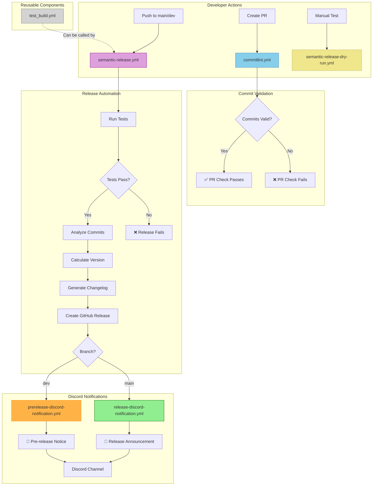

# CI/CD Workflows Architecture

This document provides an overview of Hatchling's continuous integration and continuous deployment (CI/CD) workflows, including automated testing, release management, and Discord notifications.

## Workflow Overview

Hatchling uses GitHub Actions for automated CI/CD processes. The workflows are designed to ensure code quality, automate releases, and notify the community of new versions.

## Workflow Architecture Diagram

The following diagram illustrates how all CI/CD workflows interact:

## Active Workflows

### 1. Commit Lint (`commitlint.yml`)

**Purpose:** Validates commit messages follow Conventional Commits format

**Trigger:** Pull requests to `main` and `dev` branches

**Actions:**
- Checks out repository with full history
- Sets up Node.js environment
- Installs commitlint dependencies
- Validates all PR commits against conventional commit rules

**Configuration:** `.commitlintrc.json`

**Why it matters:** Ensures consistent commit messages required for automated semantic versioning and changelog generation.

### 2. Semantic Release (`semantic-release.yml`)

**Purpose:** Automated version management and release creation

**Trigger:** Push to `main` and `dev` branches

**Actions:**
1. **Test Phase:**
   - Sets up Python 3.12 environment
   - Installs project dependencies
   - Runs full test suite (regression and feature tests)

2. **Release Phase** (if tests pass):
   - Generates GitHub App token for authentication
   - Analyzes commits since last release
   - Calculates next version based on commit types
   - Generates changelog from commit messages
   - Creates GitHub release with release notes
   - Updates `pyproject.toml` and `docs/CHANGELOG.md`
   - Commits version changes back to repository

**Configuration:** `.releaserc.json`

**Branch Behavior:**
- `main` branch: Creates production releases (e.g., v0.4.0)
- `dev` branch: Creates pre-releases (e.g., v0.5.0-dev.1)

### 3. Semantic Release Dry Run (`semantic-release-dry-run.yml`)

**Purpose:** Test semantic-release configuration without making actual releases

**Trigger:** Manual workflow dispatch with test scenarios

**Test Scenarios:**
- `current-state`: Test with current commit history
- `feat-commit`: Simulate feature commit
- `breaking-change`: Simulate breaking change
- `fix-commit`: Simulate bug fix
- `refactor-commit`: Simulate refactoring

**Actions:**
- Creates test commits based on selected scenario
- Runs semantic-release in dry-run mode
- Displays expected version bump results

**Use Case:** Validate release configuration changes before merging to main/dev branches.

### 4. Test Build (`test_build.yml`)

**Purpose:** Reusable workflow for building and testing Python packages

**Trigger:** `workflow_call` (called by other workflows)

**Actions:**
- Updates VERSION file based on branch
- Extracts version information
- Prepares version for build
- Builds Python package
- Tests package installation
- Uploads VERSION artifacts

**Outputs:** Package version number

**Use Case:** Can be called by other workflows that need to build and test the package.

### 5. Discord Release Notification (`release-discord-notification.yml`)

**Purpose:** Send Discord notifications for production releases

**Trigger:** GitHub release published (type: `released`)

**Conditions:** Only runs for releases from `main` branch

**Actions:**
- Sends formatted notification to Discord channel
- Includes role mention for announcements
- Provides release version and changelog link
- Uses green color scheme (0x00ff88)

**Configuration:** Requires `DISCORD_HATCHLING_ANNOUNCEMENTS` secret

### 6. Discord Pre-release Notification (`prerelease-discord-notification.yml`)

**Purpose:** Send Discord notifications for pre-releases

**Trigger:** GitHub release published (type: `prereleased`)

**Conditions:** Only runs for pre-releases from `dev` branch

**Actions:**
- Sends formatted notification to Discord channel
- No role mention (less intrusive for testing releases)
- Encourages testing and feedback
- Uses orange color scheme (0xff9500)

**Configuration:** Requires `DISCORD_HATCHLING_ANNOUNCEMENTS` secret

## Workflow Integration

### Release Flow

1. Developer pushes commits to `main` or `dev` branch
2. `semantic-release.yml` triggers automatically
3. Tests run to ensure code quality
4. If tests pass, semantic-release analyzes commits
5. Version is calculated and release is created
6. GitHub release event triggers Discord notification workflow
7. Community is notified via Discord

### Pull Request Flow

1. Developer creates pull request to `main` or `dev`
2. `commitlint.yml` triggers automatically
3. All commits in PR are validated
4. PR can only merge if commits follow conventional format

## Configuration Files

### `.releaserc.json`
Semantic-release configuration defining:
- Branch strategies (main for releases, dev for pre-releases)
- Commit analysis rules
- Changelog generation settings
- GitHub integration

### `.commitlintrc.json`
Commitlint configuration defining:
- Allowed commit types
- Message format rules
- Header and body length limits

### `package.json`
Node.js dependencies for:
- semantic-release and plugins
- commitlint
- commitizen (for guided commits)

## Best Practices

1. **Always use conventional commits** - Required for automated versioning
2. **Test locally first** - Use `npx semantic-release --dry-run` before merging
3. **Review PR commits** - Ensure all commits follow format before merging
4. **Monitor workflow runs** - Check GitHub Actions tab for any failures
5. **Keep dependencies updated** - Regularly update semantic-release and plugins

## Troubleshooting

### Commit Validation Fails
- Use `npm run commit` or `npx cz` for guided commit messages
- Review `.commitlintrc.json` for allowed commit types
- Ensure commit message follows format: `type(scope): description`

### Release Not Created
- Check that commits follow conventional format
- Verify tests pass in workflow run
- Review semantic-release logs in GitHub Actions
- Ensure branch is configured in `.releaserc.json`

### Discord Notifications Not Sent
- Verify `DISCORD_HATCHLING_ANNOUNCEMENTS` secret is configured
- Check that release was created (not just a tag)
- Review workflow run logs for errors
- Ensure webhook URL is valid

## Related Documentation

- [Versioning](./versioning.md) - Detailed semantic versioning guide
- [Contributing](./CONTRIBUTING.md) - Contribution guidelines including commit format

