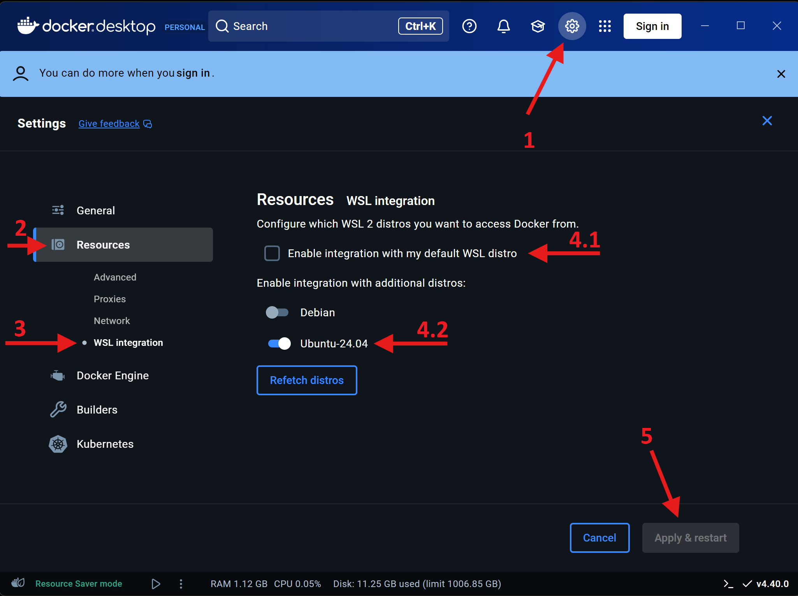
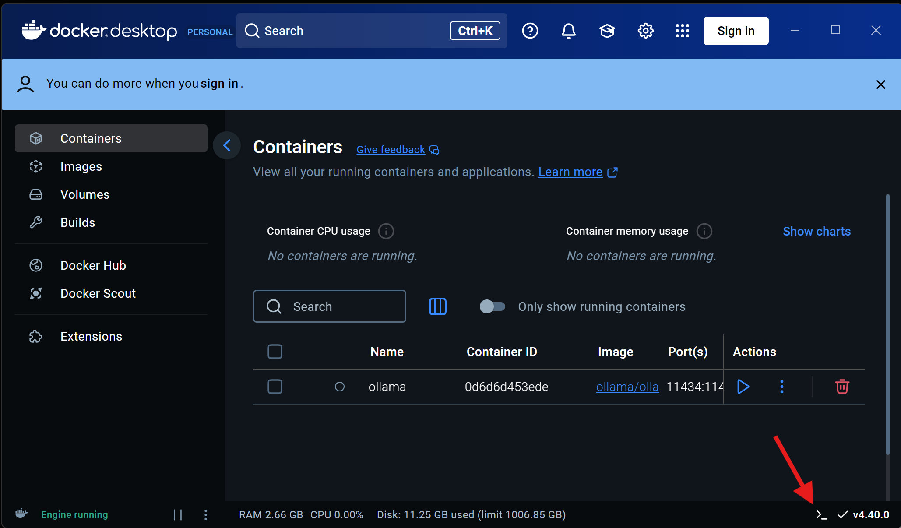
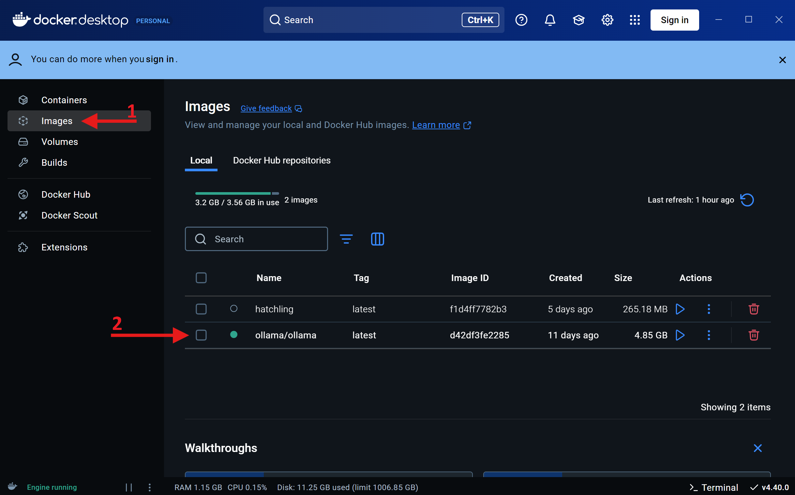

# Docker & Ollama Setup Instructions

**Previous:** None | **Next:** [Running Hatchling](./running_hatchling.md)

This article is about:

- Setting up Docker Desktop for running Hatchling
- Configuring GPU support for LLM acceleration
- Installing and configuring Ollama Docker container

This document provides instructions on how to set up and run Ollama for deploying and running local LLMs using Docker.

## Prerequisites

- Docker Desktop: [Install Docker Desktop](https://docs.docker.com/get-docker/)
   > [!Note]
   > If you wish to leverage GPUs running on a server, then you must install docker on **both** the GPU server and your local computer that will access the GPU resources. Docker on the GPU server will be used to install Ollama (this guide), and Docker on the local computer will be used to install Hatchling (next guide).
- On Windows, install Windows Subsystem for Linux (WSL). Latest version is v2: [Official Microsoft Documentation](https://learn.microsoft.com/en-us/windows/wsl/install)
- GPU Support:
  - For MacOS users with Apple Silicon chips (typically M series), you can **follow the instructions for CPU and ignore the GPU-related sections**
  - For Windows & Linux with dedicated GPUs, we strongly recommend enabling GPU support to increase LLM output speed. On the computer with the GPU, do:
    - NVIDIA GPUs: [NVIDIA Container Toolkit Installation](https://docs.nvidia.com/datacenter/cloud-native/container-toolkit/latest/install-guide.html)
    - AMD GPUs: Nothing, you can move on.

## Setup with Docker Desktop

1. **Install Docker Desktop**:
   - Download and install Docker Desktop following the official instructions: <https://docs.docker.com/get-docker/>

2. **On Windows, connect Docker to WSL**:
   
   - In Docker Desktop, follow the arrows numbered 1, 2, and 3 on the screenshot to navigate through `Settings` > `Resources` > `WSL Integration`.
   - Either enable integration with your default WSL distro (arrow 4.1) OR select a specific one (arrow 4.2)
   - Click "Apply & Restart" if you make changes (arrow 5)

3. **For NVIDIA GPU owners, setup GPU Support (nothing to do for AMD GPU owners at this stage)**:
   - Open a terminal on the computer with the GPU you want to use (for GPU servers, you likely connect through ssh)
     - On Windows, launch the Linux version that was installed via WSL and that Docker is using. For example, in the previous image, that would be `Ubuntu-24.04`; so, run `wsl -d Ubuntu-24.04` to start Ubuntu.
   - For NVIDIA GPU support, run:

     ```bash
     # Add NVIDIA repository keys
     curl -fsS https://nvidia.github.io/libnvidia-container/gpgkey | sudo gpg --dearmor -o /usr/share/keyrings/nvidia-container-toolkit-keyring.gpg
     
     # Add NVIDIA repository
     curl -s -L https://nvidia.github.io/libnvidia-container/stable/deb/nvidia-container-toolkit.list | sed 's#deb https://#deb [signed-by=/usr/share/keyrings/nvidia-container-toolkit-keyring.gpg] https://#g' | sudo tee /etc/apt/sources.list.d/nvidia-container-toolkit.list
     
     # Update package lists
     sudo apt-get update
     
     # Install NVIDIA container toolkit
     sudo apt-get install -y nvidia-container-toolkit
     
     # Configure Docker runtime
     sudo nvidia-ctk runtime configure --runtime=docker
     ```

   - Close the terminal
   - Restart Docker
     - For Docker Desktop, click on the three vertical dots icon (arrow 1), then `Restart` (arrow 2)
   
     - On Linux (Ubuntu, Debian, CentOs, Fedora), running: `systemctl restart docker` should do it. You can prepend with `sudo` if necessary.

4. **Pull Ollama Image**:
   - Open a terminal capable of running docker commands.
     - In Docker Desktop you can open it by pressing the `Terminal` button:
     
     - Or any terminal of your system that can access to Docker
   - Write `docker pull ollama/ollama` in the terminal and press enter to run it.
     - It will download about 1.6GB (as of May 2025)
     - Once finished, click on the `Images` tab (arrow 1) of Docker Desktop, and check that `ollama/ollama` is available (arrow 2)
       
       - If it does not show up, try closing Docker Desktop (arrow 1, then arrow 2) and launch it again.
       
     - Alternatively, to check that the image exists, you can run the command `docker images -a`. The output should include a line similar to `ollama/ollama   latest    d42df3fe2285   11 days ago   4.85GB` (May 2025)

## Additional Resources

- [Docker Documentation](https://docs.docker.com/)

---

**Previous:** None | **Next:** [Running Hatchling](./running_hatchling.md)
